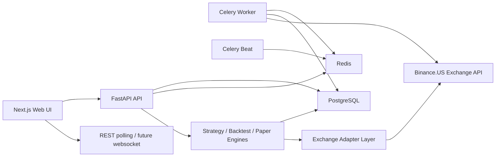

# Trader MVP Architecture

## Target architecture



## Core decisions

- `FastAPI + SQLAlchemy + Alembic` keeps the backend modular and easy to extend into live trading later.
- `Celery + Redis` gives immediate parallelism for historical sync, backtests, and future execution jobs without overcomplicating the MVP.
- `ExchangeAdapter` isolates Binance.US-specific logic from the rest of the domain model.
- `BaseStrategy` plus a strategy registry gives four independent strategy modules with separate config, signals, positions, trades, and metrics.
- `PostgreSQL` stores canonical market data, runs, logs, and results so backtests and paper trading can share the same candle history.
- `Next.js` provides a clean operator UI with dashboard, strategy drilldown, data manager, logs, and backtest workflows.

## Folder structure

```text
.
├── apps
│   ├── api
│   │   ├── alembic
│   │   ├── app
│   │   │   ├── api
│   │   │   ├── background
│   │   │   ├── core
│   │   │   ├── domain
│   │   │   ├── engines
│   │   │   ├── exchanges
│   │   │   ├── repositories
│   │   │   ├── seeds
│   │   │   ├── services
│   │   │   └── strategies
│   │   └── app/tests
│   └── web
│       ├── app
│       ├── components
│       └── lib
├── docker-compose.yml
└── docs
```

## Runtime flows

### Historical sync

1. UI or scheduler creates `sync_job`.
2. Worker fetches Binance.US candles through the adapter with retry/backoff.
3. Data is normalized, deduplicated, validated, and upserted into `candles`.
4. Sync state and logs are persisted for the Data Manager screen.

### Paper trading

1. Active strategies stay isolated by `strategy_id`, config, paper account, and positions.
2. A scheduled worker reads the latest candles per symbol/timeframe.
3. `StrategyEngine` asks the strategy for signal, risk decision, and simulated execution.
4. Orders, positions, trades, metrics, and logs are written independently per strategy.

### Backtest

1. API creates a `backtest_run` row and enqueues a worker job.
2. `BacktestEngine` replays historical candles candle-by-candle using one strategy instance.
3. Fees, slippage, equity curve, trades, and summary stats are computed and saved.
4. UI reads the result and supports JSON/CSV export.
